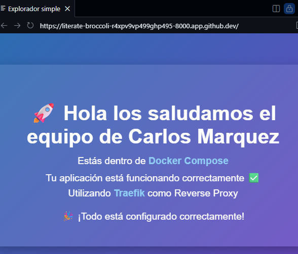
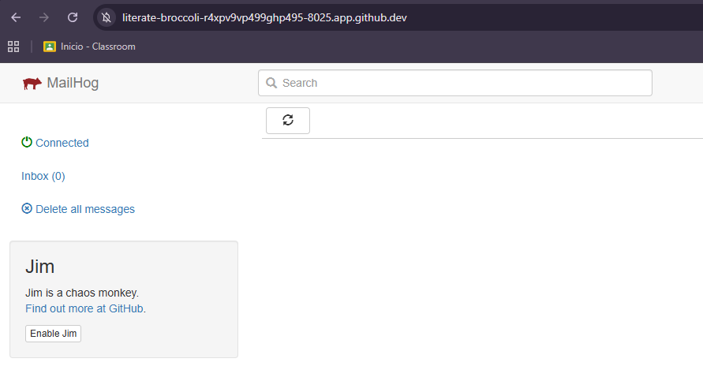
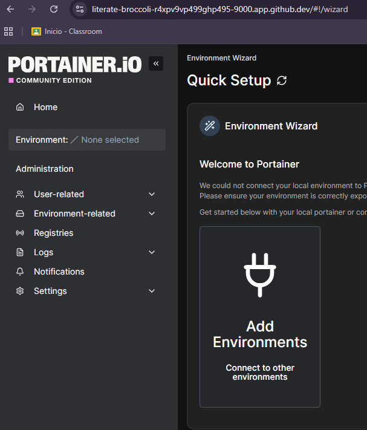

# AUIND-docker-devops-lab-cmarquez

#Empezando la configuración del laboratorio Carlos Márquez 7:55AM 21May26
    #Creación de carpetas: Principal laboratorio-docker-cmarquez y sub-carpetas: app, mailhos, portainer, redis y traefik

#Autor Carlos Marquez 8:15AM 21May26
  #Carpeta Traefik
    Creación y habilitación de Traefik:
      comandos: "cd traefik", "docker network create proxy", "nano docker-compose.yml" y se agrega el siguiente codigo:
      services:
=========================================================================================================================================
        "traefik:
          image: traefik:v2.10

          command:
            - "--api.insecure=true"
            - "--api.dashboard=true"

            # ✅ ENTRYPOINT WEB (app)
            - "--entrypoints.web.address=:8080"

            # ✅ ENTRYPOINT TRAEFIK (dashboard)
            - "--entrypoints.traefik.address=:8081"

            - "--providers.file.directory=/etc/traefik"

          ports:
            - "8000:8080"   # app
            - "8081:8081"   # dashboard

          volumes:
            - ./dynamic.yml:/etc/traefik/dynamic.yml

          networks:
            - proxy

        networks:
          proxy:
            external: true"

  tambien se crea el documento "dynamic.yml" dentro de la carpeta de traefik con el siguienbte bloque de codigo:

    http:
      routers:

        
        mailhog:
          rule: "PathPrefix(`/mail`)"
          service: mailhog-service
          entryPoints:
            - web
          middlewares:
            - mailhog-strip
          priority: 100

        portainer:
          rule: "PathPrefix(`/portainer`)"
          service: portainer-service
          entryPoints:
            - web
          middlewares:
            - portainer-strip
          priority: 90

        web:
          rule: "PathPrefix(`/`)"
          service: web-service
          entryPoints:
            - web
          priority: 1

      services:

        web-service:
          loadBalancer:
            servers:
              - url: "http://web:80"

        portainer-service:
          loadBalancer:
            servers:
              - url: "http://portainer:9000"

        mailhog-service:
          loadBalancer:
            servers:
              - url: "http://mailhog:8025"

      middlewares:

        portainer-strip:
          stripPrefix:
            prefixes:
              - "/portainer"

        mailhog-strip:
          stripPrefix:
            prefixes:
              - "/mail"

==========================================================================================================================================

#Autor: Carlos Marquez 8:26AM 21May26

  #Carpeta APP
  Se crea dentro de la carpeta de app lo siguiente:  "index.html" y "docker-compose.yml"

El archivo index.html solo tendra lo siguiente:

        <!DOCTYPE html>
        <html lang="es">
        <head>
          <meta charset="UTF-8">
          <title>Docker + Traefik</title>

          
        </head>

        <body>

          

            <h1>🚀 Hola los saludamos el equipo de Carlos Marquez</h1>

            
Estás dentro de Docker Compose

            
Tu aplicación está funcionando correctamente ✅

            
Utilizando Traefik como Reverse Proxy

            

              🎉 ¡Todo está configurado correctamente!
            

          

        </body>
        </html>

      
El archivo docker-compose.yml tendra lo siguiente:

        services:
          web:
            image: nginx:latest
            container_name: web

            volumes:
              - ./index.html:/usr/share/nginx/html/index.html

            networks:
              - proxy

        networks:
          proxy:
            external: true

Una vez creado los archivos procedemos a dar de alta los servicios con: "docker compose up -d" y probamos llendo al URL del puerto en el cual se habilito:
      
==========================================================================================================================================

#Autor: Carlos Marquez 8:47AM 21May26

#Integracion de Redis:

  Aqui lo que se hara es dentro de la carpeta de Redis, se generará el archivo "docker-compose.yml" con la siguiente configuración:

    services:

        redis:
          image: redis:7-alpine
          container_name: redis

          ports:
            - "6379:6379"

          volumes:
            - redis_data:/data

          networks:
            - proxy

    volumes:
      redis_data:

    networks:
      proxy:
        external: true

  Una vez hecho lo anterior solo damos de alta los servicios y probamos: docker compose up -d, docker exec -it redis redis-cli y escribimos PING y nos debe de responder un cun PONG
==========================================================================================================================================
#Autor: Carlos Marquez 9:18AM 21May26

#Integración de MailHog:

Para esto ingresaremos a MailHog y crearemos la carpeta "docker-compose.yml" y se agregaremos el siguiente bloque de codigo:

      services:

        mailhog:
          image: mailhog/mailhog
          container_name: mailhog
          ports:
            - "8025:8025"

          networks:
            - proxy

      networks: 
        proxy:
          external: true

  Una vez hecho lo anterior habilitamos los servicios con : docker compose up -d y probamos ingresando al URL del puerto en el que se habilito.
    
==========================================================================================================================================
#Autor: Carlos Marquez 9:43AM 21May26

Integración de Portainer:

Para esto haremos lo que hemos estado haciendo crear dentro de la carperta de portainer el documento: "docker-compose.yml" con el siguiente bloque de codigo:

      services:

        portainer:
          image: portainer/portainer-ce
          container_name: portainer

          volumes:
            - /var/run/docker.sock:/var/run/docker.sock

          ports:
            - "9000:9000"   # 🔥 ACCESO DIRECTO

          networks:
            - proxy

      networks:
        proxy:
          external: true
Y levantamos los servicios con: "docker compose up -d" y verificamos ingresando al URL del puerto que creamos:
    

